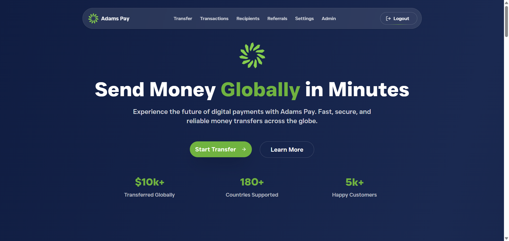
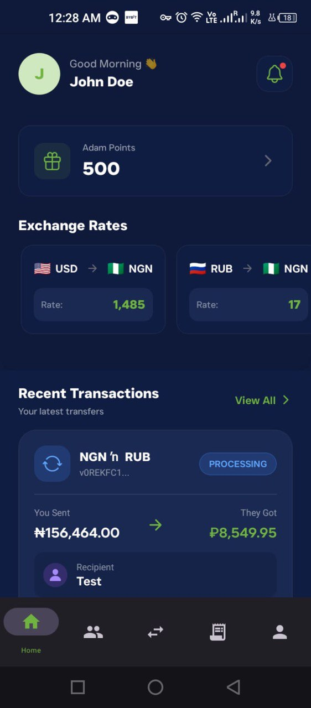

# AdamsPay — Global Money Transfer Platform

> A full-stack fintech platform with a web app and a native mobile app for international money transfers — supporting 180+ countries, biometric authentication, Apple OAuth, Firebase push notifications, and real-time exchange rates.

**Live:** [adams-pay.com](https://adams-pay.com)

---

## Screenshots

### Web Platform


*Landing page with global transfer stats: $10k+ transferred, 180+ countries, 5k+ happy customers*

---

## Key Metrics

| Metric | Value |
|--------|-------|
| Total Transferred | $10,000+ |
| Countries Supported | 180+ |
| Happy Customers | 5,000+ |

## What This Is

AdamsPay is a money transfer platform I built end-to-end — a **Next.js web app** for the marketing site and dashboard, plus an **Expo React Native mobile app** with biometric login, Apple OAuth, and Firebase push notifications for real-time transfer updates.

The tagline says it all: "Send Money Globally in Minutes."

## Key Features

### Transfer Flow
A streamlined multi-step process: select country → enter amount → choose recipient → confirm & send. Real-time exchange rate display shows users exactly what the recipient will receive before they commit. Available on both web and mobile.

### Mobile App (Expo React Native)
A full-featured mobile companion app with tab-based navigation:
- **Home** — Dashboard with balance, recent transfers, quick actions
- **Transactions** — Full transfer flow with multi-currency support
- **Recipients** — Save and manage frequently-used recipients
- **Settings** — Profile management, preferences, security settings

### Biometric Authentication
The mobile app supports **fingerprint and Face ID** for quick, secure login. Users authenticate once with credentials, then use biometrics for subsequent sessions — no typing passwords on a phone.

### Apple OAuth & Social Login
One-tap sign-in with Apple ID on iOS. The auth flow handles token exchange, profile creation, and session management seamlessly.

### Firebase Push Notifications
Real-time push notifications via Firebase Cloud Messaging for:
- Transfer status updates (pending → completed/failed)
- Recipient confirmations
- Security alerts

### User Authentication (Web)
Secure registration and login with Next.js middleware-level route protection. Users are redirected before any protected page component renders — no flash of authenticated content.

### Recipient Management
Save frequently-used recipients with their bank details across both web and mobile. Recipient data syncs between platforms.

### Transaction History
Track all past transfers: amount sent, amount received, exchange rate at time of transfer, recipient info, and status (pending/completed/failed).

## Tech Stack

| Layer | Technology |
|-------|-----------|
| **Web** | Next.js 14 (App Router), TypeScript, TailwindCSS |
| **Mobile** | Expo React Native, TypeScript |
| **Auth** | Custom auth + Apple OAuth + Biometrics |
| **Notifications** | Firebase Cloud Messaging |
| **State** | React Context |
| **Deployment** | Vercel (web), EAS Build (mobile) |

## Architecture

The project is split across three repositories:

```
adams-pay (Public)           adamspay-app (Private)
├── Landing page             ├── Expo React Native mobile app
├── Marketing content        ├── app/
└── Public-facing site       │   ├── (auth)/        # Login, register, Apple OAuth
                             │   ├── (root)/
                             │   │   ├── (tabs)/     # Tab navigation
                             │   │   ├── home/       # Dashboard
                             │   │   ├── recipients/ # Recipient management
                             │   │   ├── settings/   # User preferences
                             │   │   └── transaction/# Transfer flow
                             │   ├── api/            # API routes
                             │   └── biometrics-prompt.tsx
                             ├── components/   # UI components
                             ├── context/      # State management
                             ├── hooks/        # Custom hooks
                             ├── lib/          # Utilities
                             └── types/        # TypeScript types
```

The public repo handles the marketing/landing page. The private repo contains the full mobile application with biometric auth, Apple OAuth, push notifications, and the complete transfer flow.

## Design

The UI uses a **dark navy (#0a1628) and green (#4ade80) palette** — a deliberate choice that signals trust and financial security. The dark theme reduces visual fatigue for users checking exchange rates frequently.

Key design elements:
- Clean, minimal hero with a single clear CTA ("Start Transfer")
- Animated statistics counters for social proof
- Two-column layout for the transfer form (send/receive amounts side by side)
- Status indicators with clear color coding (green for success, amber for pending)

## Technical Decisions

**Why Expo over bare React Native?** EAS Build handles the entire iOS/Android build pipeline — no Xcode or Android Studio setup needed. Expo Router gives file-based routing that mirrors the Next.js web app structure, making cross-platform mental models consistent.

**Why biometrics + Apple OAuth?** For a financial app, authentication UX is critical. Nobody wants to type a 16-character password on their phone to check a transfer status. Biometrics for returning users + Apple OAuth for signup reduces friction while maintaining security.

**Why Firebase for push notifications?** FCM handles both iOS and Android with a single integration. Transfer status updates need to reach users immediately — Firebase's delivery reliability and Expo's push notification infrastructure make this seamless.

**Why split web and mobile into separate repos?** Different build pipelines (Vercel vs EAS), different dependencies, and different release cycles. The web site can deploy instantly on every commit; mobile releases go through App Store review. Keeping them separate avoids coupling.

## What I'd Improve

- **Add real payment gateway integration** — connect with licensed money transfer operators
- **Implement KYC verification** — identity verification flow for regulatory compliance
- **Add transfer scheduling** — recurring transfers on a set schedule
- **Build an admin dashboard** — internal tool for monitoring transfers and managing users

---

**Built by [Abdurrahman Idris](https://abdurrahmanidris.com)** — Full Stack Developer
